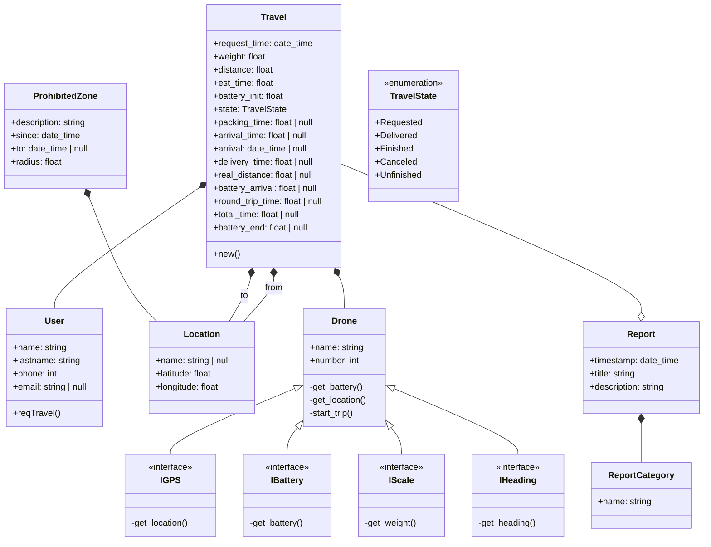

# central-system

```mermaid
classDiagram

    Travel *-- User
    Travel *-- Location : from
    Travel *-- Location : to
    Travel *-- Drone
    Travel --o Report
    Drone <|-- IGPS
    Drone <|-- IBattery
    Drone <|-- IScale
    Drone <|-- IHeading
    Report *-- ReportCategory
    ProhibitedZone *-- Location

    class Travel {
        +request_time: date_time
        +weight: float
        +distance: float
        +est_time: float
        +battery_init: float
        +state: TravelState
        +packing_time: float | null
        +arrival_time: float | null
        +arrival: date_time | null
        +delivery_time: float | null
        +real_distance: float | null
        +battery_arrival: float | null
        +round_trip_time: float | null
        +total_time: float | null
        +battery_end: float | null
        
        +new()
    }

    class Location {
        +name: string | null
        +latitude: float 
        +longitude: float 
    }

    class ProhibitedZone {
        +description: string
        +since: date_time
        +to: date_time | null
        +radius: float
    }

    class User {
      +name: string 
      +lastname: string 
      +phone: int
      +email: string | null 

      +reqTravel()
    }

    class Drone {
        +name: string
        +number: int

        -get_battery()
        -get_location()
        -start_trip()
    }

    class Report {
        +timestamp: date_time
        +title: string
        +description: string
    }

    class ReportCategory {
        +name: string
    }

    class TravelState {
        <<enumeration>>
        +Requested
        +Delivered
        +Finished
        +Canceled
        +Unfinished
    }

    class IGPS {
        <<interface>>
        -get_location()
    }

    class IBattery {
        <<interface>>
        -get_battery()
    }

    class IScale {
        <<interface>>
        -get_weight()
    }

    class IHeading{
        <<interface>>
        -get_heading()
    }
```
