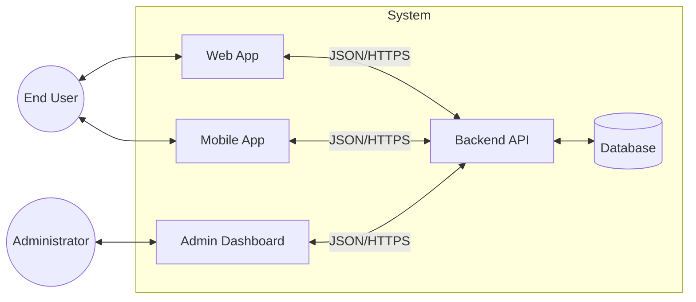
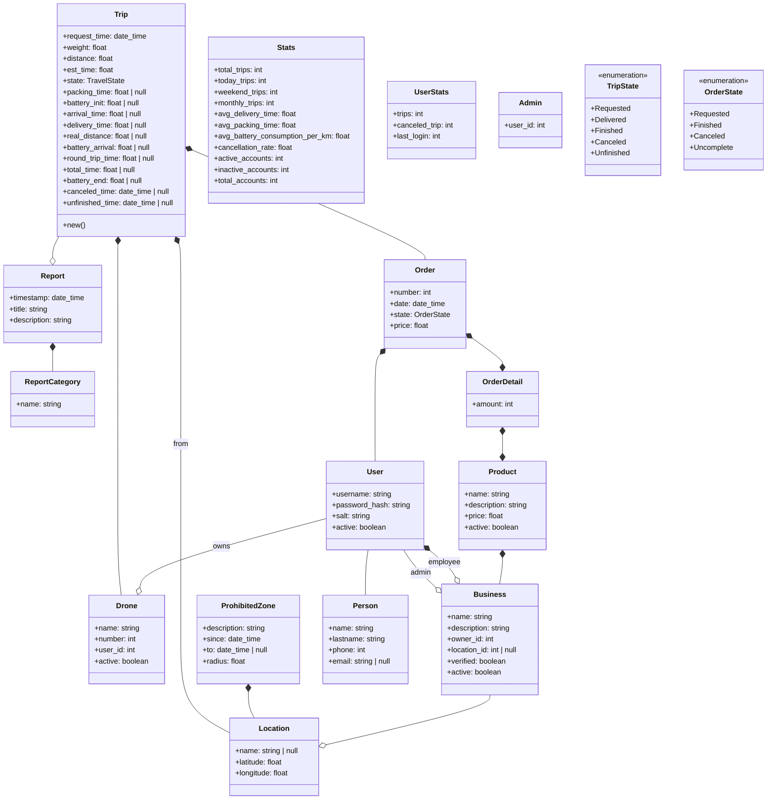
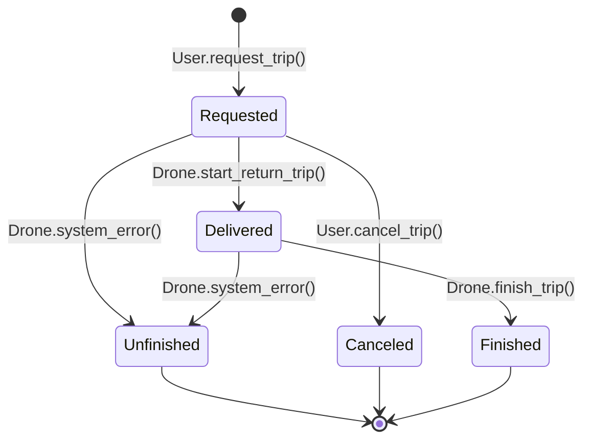

  

# Vector Sur Backend

## Architecture Diagram

## Class Diagram

## Trip State Diagram

## Authentication

The backend uses **JWT** for authentication with **bcrypt** for password hashing.

### Password Security

- **Hashing Algorithm**: bcrypt with salt (cost factor: 12)
- **Salt**: Automatically generated and embedded in the hash by bcrypt
- **Hash Format**: `$2b$12$[22-char-salt][31-char-hash]`

### JWT Configuration

- **Algorithm**: HS256 (HMAC with SHA-256)
- **Token Expiration**: 1 hour
