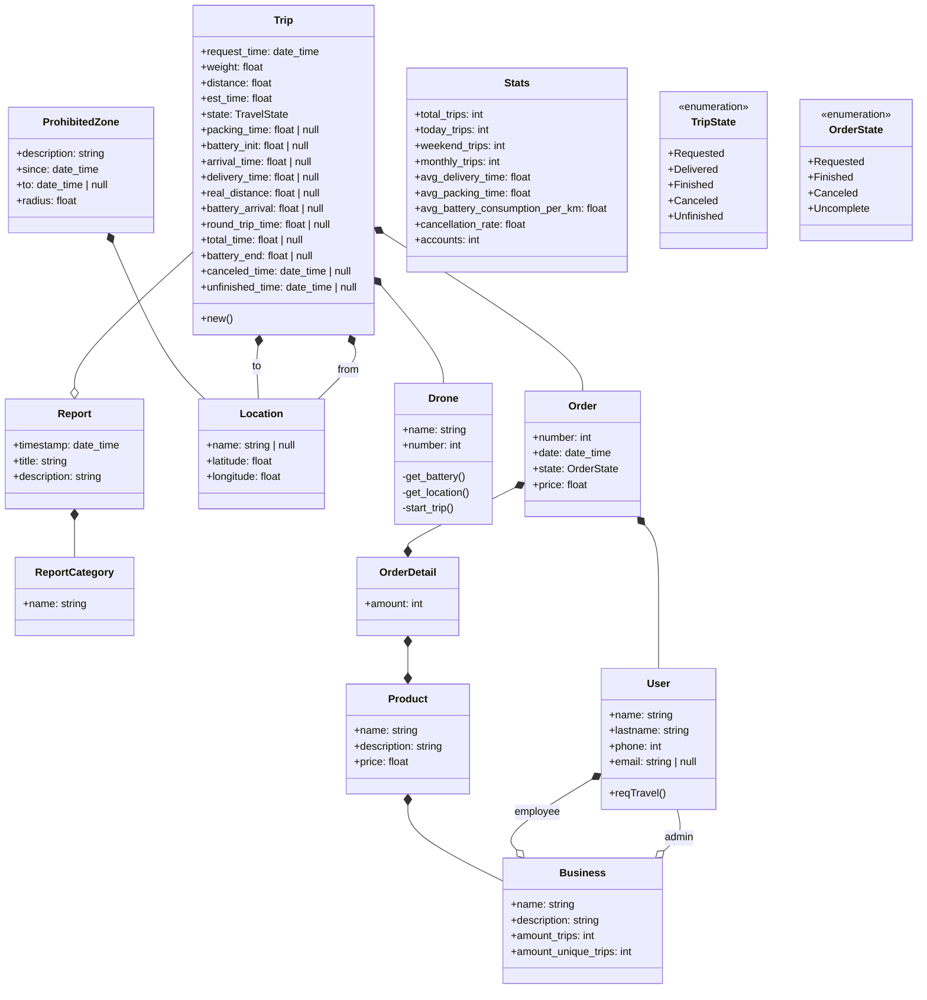
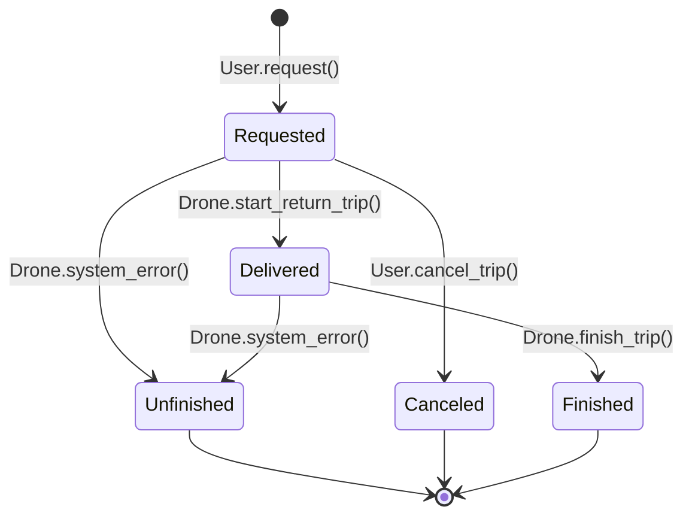

# Backend

## Class Diagram

```mermaid
 classDiagram

    Order *-- User
    Trip *--  Order
    Trip *-- Location : from
    Trip *-- Location : to
    Trip *-- Drone
    Trip --o Report
    Report *-- ReportCategory
    ProhibitedZone *-- Location
    User --o Business : admin
    User *--o Business : employee
    Product *-- Business
    Order *--* OrderDetail
    OrderDetail *--* Product

    class OrderDetail {
        +amount: int
    }

    class Stats {
        +total_trips: int
        +today_trips: int
        +weekend_trips: int
        +monthly_trips: int

        +avg_delivery_time: float
        +avg_packing_time: float

        +avg_battery_consumption_per_km: float

        +cancellation_rate: float

        +accounts: int
    }

    class Order {
        +number: int
        +date: date_time
        +state: OrderState
        +price: float
    }
    
    class Trip {
        +request_time: date_time
        +weight: float
        +distance: float
        +est_time: float
        +state: TravelState
        +packing_time: float | null
        +battery_init: float | null
        +arrival_time: float | null
        +delivery_time: float | null
        +real_distance: float | null
        +battery_arrival: float | null
        +round_trip_time: float | null
        +total_time: float | null
        +battery_end: float | null
        +canceled_time: date_time | null
        +unfinished_time: date_time | null
        
        +new()
    }

    class Location {
        +name: string | null
        +latitude: float 
        +longitude: float 
    }

    class Product {
        +name: string
        +description: string 
        +price: float 
    }

    class Business {
        +name: string
        +description: string
        +amount_trips: int
        +amount_unique_trips: int
    }

    class ProhibitedZone {
        +description: string
        +since: date_time
        +to: date_time | null
        +radius: float
    }

    class User {
      +name: string 
      +lastname: string 
      +phone: int
      +email: string | null 

      +reqTravel()
    }

    class Drone {
        +name: string
        +number: int

        -get_battery()
        -get_location()
        -start_trip()
    }

    class Report {
        +timestamp: date_time
        +title: string
        +description: string
    }

    class ReportCategory {
        +name: string
    }

    class TripState {
        <<enumeration>>
        +Requested
        +Delivered
        +Finished
        +Canceled
        +Unfinished
    }

    class OrderState {
        <<enumeration>>
        +Requested
        +Finished
        +Canceled
        +Uncomplete
    }


```
## Trip State Diagram

```mermaid
stateDiagram-v2
    [*] --> Requested : User.request()
    Requested --> Unfinished : Drone.system_error()
    Delivered --> Finished: Drone.finish_trip()
    Requested --> Canceled: User.cancel_trip()
    Delivered --> Unfinished: Drone.system_error()
    Unfinished --> [*]
    Canceled --> [*]
    Requested --> Delivered: Drone.start_return_trip()
    Finished --> [*]
```
